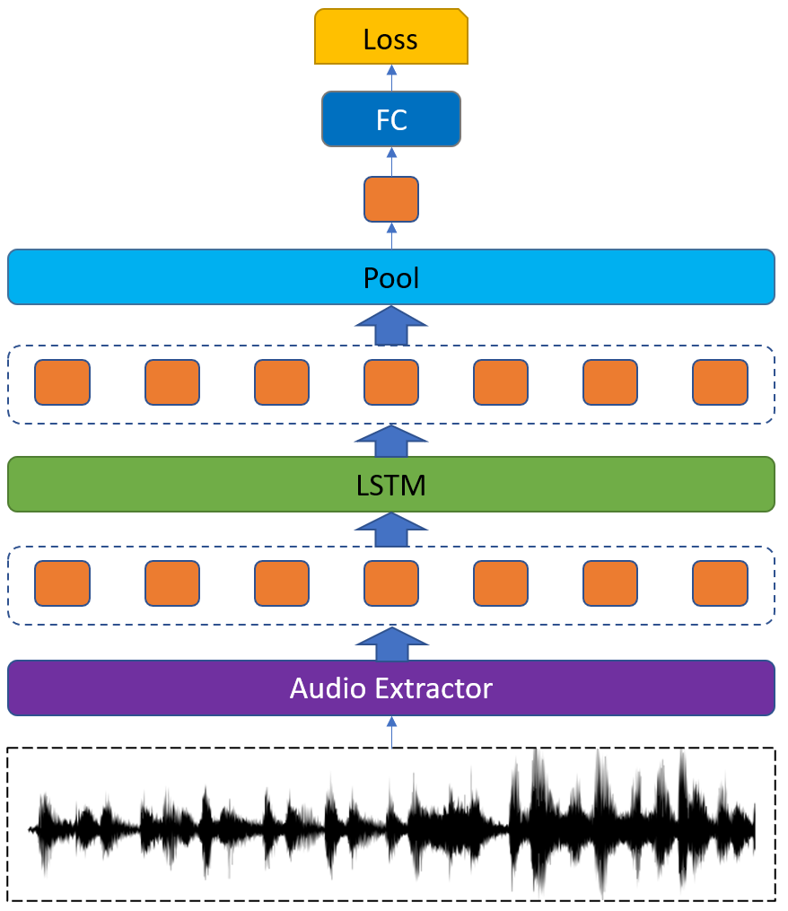

# Fine-tuning Wav2vec for Vocal-burst Emotion Recognition

This is the source code of our proposed method in [Fine-tuning Wav2vec for Vocal-burst Emotion Recognition]()

We (SclabCNU Team) paticipated in [The 2022 ACII Affective Vocal Burst Workshop & Challenge](https://www.competitions.hume.ai/avb2022).

We used pre-train Wav2Vec provided by [Pytorch] (https://pytorch.org/audio/0.10.0/pipelines.html)

# Model Architecture

The best performances on validation set of the HUME-VB dataset are listed below:

| Task | Two | High | Culture | Type |
| --- | --- | ---| ---| ---|
| Performance | 61.94 | 65.41 | 53.39 | 49.89 |
